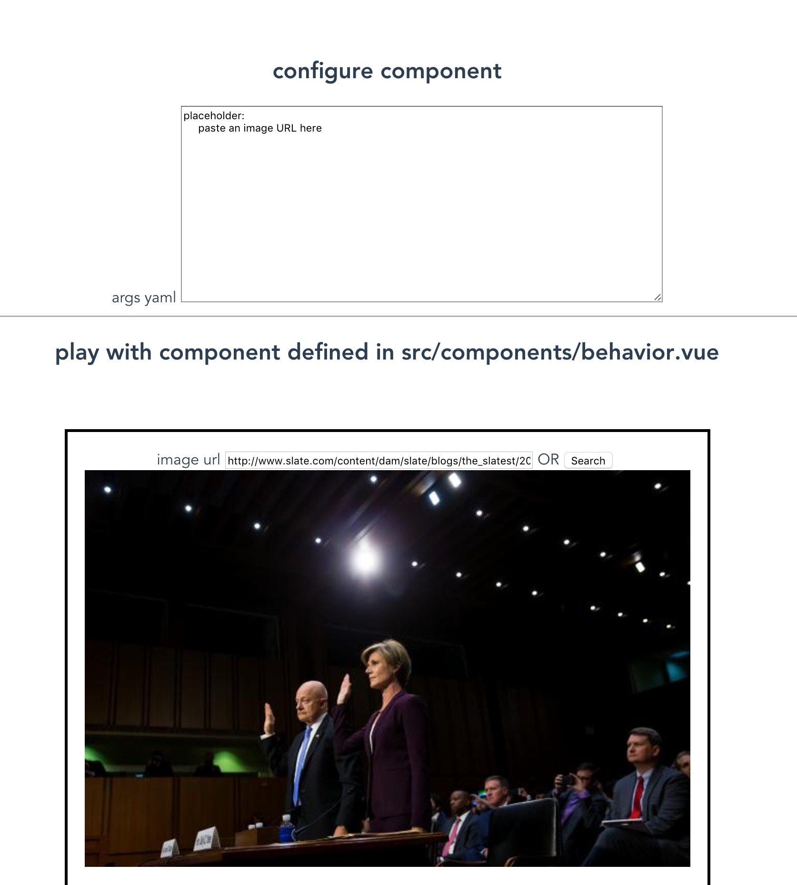

# clay-behavior-editor

The code is really rough, no judging!

This is a thingy to quickly prototype Kiln behaviors. It simulates the Kiln environment while enabling you to live-edit. 

You can experiment with the behavior of the component here, then move the code to Clay when it's ready to be refined and styled.

See this [short demo video](https://drive.google.com/a/slate.com/file/d/0B214FhZUet0TbHE5NG9rX0ZiMzg/view?usp=sharing). for a better idea of what clay-behavior-editor does

## Install

`yarn install` or `npm install` in this directory

## Prototype a Behavior

`npm start`

The command above should open your browser, and you can play with the component. For the sample component, try pasting in an image in "image url" text box.

Then change `src/components/behavior.vue`. Your changes will be reflected without your having to refresh the page.

You can also edit the yaml in the top of the screen to pass different arguments to the behavior. That way you can see what it would be like to edit the schema.yaml of a component that uses the behavior.

This will make more sense if you go straight to [the demo video](https://drive.google.com/a/slate.com/file/d/0B214FhZUet0TbHE5NG9rX0ZiMzg/view?usp=sharing).
